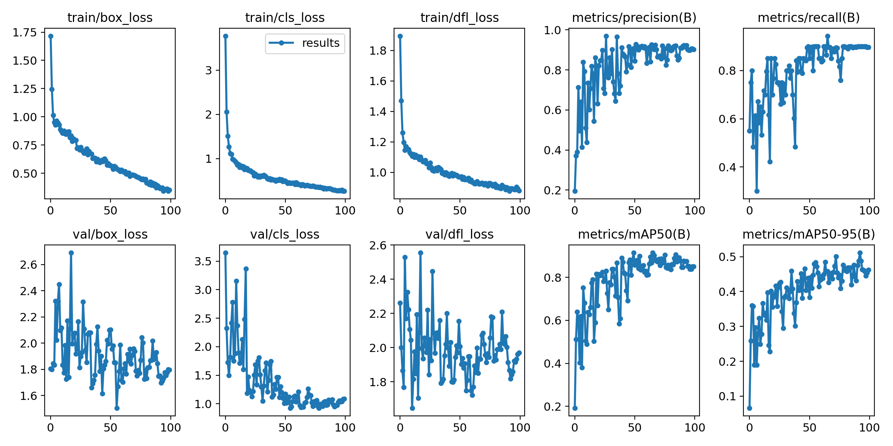

# Mask Check
The purpose of "Mask Check" is to provide a simple and easy-to-use tool for checking if people in images and videos are wearing face masks

# Installation
- Install the required dependecies
` pip install -r requirements.txt `

- Download model weights
` bash setup.sh `

- Launch Streamlit app
` streamlit run mask_check.py `

# Usage

The application can be run in three distinct modes: Image mode, Video mode, and Webcam mode (which is a subset of Video mode). In Image mode, you upload an image, and the application will automatically detect and return the relevant results. 

In Video mode, users are able to upload a video file and receive corresponding results. Webcam mode, which is nested within Video mode, enables users to run the model on input data captured directly from a webcam. Outputs from the Video mode and Webcam mode can be saved by checking the 'Record' checkbox.

# Features

- Image and Video upload
- Face detection
- Mask detection
- FPS counter
- Results display
- Webcam inference

# Built Using
- [Python](https://python.org)
- [YOLOv8](https://ultralytics.com/yolov8)
- [Roboflow](https://roboflow.com/)
- [Streamlit](https://streamlit.io/)
    
# Details

- Dataset: With regard to the [dataset](https://universe.roboflow.com/deedaxinc/face-mask-detection-uamjv/browse?queryText=&pageSize=50&startingIndex=0&browseQuery=true), approximately half of the 150+ images were self-collected by myself, using a webcam to capture a wide array of facial expressions and features, including frontal and side-facing poses, wearing sunglasses, hats, and headphones. The remaining images were sourced from the internet and were chosen to represent a diverse range of skin tones and races. To balance out the dataset, which was originally heavily skewed towards male subjects due to the local self-collected data being exclusively male, the additional images were chosen to include a slightly higher proportion of female subjects.

- Data augmentation: The augmentation techniques employed included a range of carefully chosen image manipulations designed to enhance the dataset's diversity and improve model generalization. Each augmentation was meticulously considered for its potential impact on performance, ensuring that the resulting dataset was both comprehensive and representative of real-world scenarios.

    - Crop: 0% Minimum Zoom, 20% Maximum Zoom
    - Rotation: Between -10° and +10°
    - Blur: Up to 2px
    - Noise: Up to 5% of pixels
    - Cutout: 10 boxes with 8% size each
    - Bounding Box: Brightness: Between -25% and +25%
    - Bounding Box: Exposure: Between -25% and +25%

- Model selection: The selection of YOLOv8s was based on its state-of-the-art design, combined with its compact size (~20MB) and high level of accuracy

# Performance

Results shown below are from training the model using YOLOv8s for 100 epochs. See [notebook](training_mask_check.ipynb)

# Limitations

- Relatively low frame rate of approximately 2 frames per second during video inference.

# Contact

Dahir Ibrahim (Deedax Inc)  
Email - dahiru.ibrahim@outlook.com  
Twitter - https://twitter.com/DeedaxInc  
YouTube - https://www.youtube.com/@deedaxinc  
Project Link - https://github.com/Daheer/mask-check

